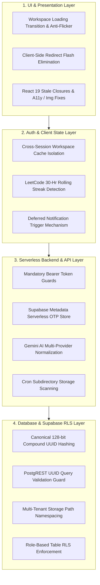

# 🛡️ LynDesk Master Remediation Plan & Full-Stack Codebase Health Audit

**Last Updated**: 2026-08-21  
**Lead AI Architect**: Luna  
**Protocol**: The Luna Protocol (Strict Grounded Standard)

---

## 🏗️ 1. Full-Stack Layer Architecture & Criticality Breakdown

---

## 🎯 2. Deep-Dive: Specific Root Causes & Production Solutions

### 🔹 Issue A: Workspace Loading Screen Flicker & Async Data Pop-in
- **Root Cause**: [`src/app/workspace/[id]/page.tsx`](file:///C:/Users/shree/shree_projects/eventtracker/src/app/workspace/%5Bid%5D/page.tsx) mounts immediately without a dedicated loading gate. As background promises (`project_spaces`, `project_members`, `project_tasks`, `workspace_presence`) resolve at different intervals, layout elements jump and pop in full view.
- **Industry Standard Solution**:
  1. Add `isWorkspaceHydrating` state initialized to `true`.
  2. Await initial parallel queries via `Promise.allSettled`.
  3. Display `<LynDeskLoadingCard message="Initializing Workspace..." subtext="Syncing project vault, realtime channel & team presence..." minHeight="min-h-[600px]" />`.
  4. Render the fully hydrated workspace smoothly with `framer-motion` `<AnimatePresence>` once all critical data is loaded.

---

### 🔹 Issue B: Spurious Workspaces Appearing on Logout / Login
- **Root Cause**: [`src/app/event-desk/page.tsx:731`](file:///C:/Users/shree/shree_projects/eventtracker/src/app/event-desk/page.tsx#L731) uses an un-scoped global fallback `localStorage.getItem("ldk_joined_workspaces")`. Workspaces joined in earlier sessions or seeded in browser memory bleed into new user accounts.
- **Industry Standard Solution**:
  1. Strictly scope all workspace cache keys to user UUID: `ldk_joined_workspaces_${user.id}` and `ldk_events_${user.id}`.
  2. In `event-desk/page.tsx`, eliminate all un-scoped global fallback reads.
  3. Ensure `AuthContext.tsx` cleanly wipes user-specific and cached workspace keys upon `SIGNED_OUT`.

---

### 🔹 Issue C: LeetCode Daily Challenge False "Pending" & Premature Notification Trigger
- **Root Cause**:
  1. In [`src/app/api/coding-stats/route.ts:246`](file:///C:/Users/shree/shree_projects/eventtracker/src/app/api/coding-stats/route.ts#L246), `hasSolvedExactDaily` matches `subDateKeyUTC === dailyDate`. Submissions made within the active 24-hour cycle that cross timezone boundaries or have slight slug variations evaluate to `completed: false`.
  2. In [`src/app/coding-deck/page.tsx:408`](file:///C:/Users/shree/shree_projects/eventtracker/src/app/coding-deck/page.tsx#L408), streak warning notifications fire on mount using *stale cached stats* before the live fetch completes.
- **Industry Standard Solution**:
  1. In `/api/coding-stats`:
     - Normalize problem slugs (`replace(/[^a-z0-9]/g, "")`).
     - Check submission timestamps against a 30-hour rolling global timezone window OR matching local/UTC dates.
     - Leverage `dailyCodingChallengeV2` challenge list and user status.
  2. In `coding-deck/page.tsx`:
     - Defer notification dispatch until the live API fetch confirms completion.
     - Immediately purge pending alerts if `dailyChallenge.completed === true`.

---

### 🔹 Issue D: PostgREST UUID Crash in WallCalendar Event Sync
- **Root Cause**: In [`src/app/lib/wallCalendarSync.ts:143`](file:///C:/Users/shree/shree_projects/eventtracker/src/app/lib/wallCalendarSync.ts#L143), `supabase.from("wall_calendar_events").delete().or("id.eq." + idOrSourceId + ",source_id.eq." + idOrSourceId)` fails with Postgres error `invalid input syntax for type uuid: "opp_1"` when `idOrSourceId` is a non-UUID string.
- **Industry Standard Solution**: Check `isValidUuid(idOrSourceId)` before querying `id.eq`, matching non-UUID strings strictly against `source_id.eq`.

---

## 📋 3. Master Phased Remediation Plan

### 🔒 Phase 1: Security, Authorization & Serverless State (5 Files)
| Task ID | Target File | Issue & Security Impact | Industry Standard Fix |
| :--- | :--- | :--- | :--- |
| **1.1** | [`src/app/api/notifications/send/route.ts`](file:///C:/Users/shree/shree_projects/eventtracker/src/app/api/notifications/send/route.ts) | Unauthenticated notification injection & spoofing | Enforce mandatory Bearer token validation with `createAdminClient()`; verify `user.id === senderId`. |
| **1.2** | [`src/app/api/user/notifications/route.ts`](file:///C:/Users/shree/shree_projects/eventtracker/src/app/api/user/notifications/route.ts) | Unauthenticated notification deletion & reading | Require authentication and verify `auth.uid() === userId`. |
| **1.3** | [`src/app/api/workspace/rename/route.ts`](file:///C:/Users/shree/shree_projects/eventtracker/src/app/api/workspace/rename/route.ts) | Anonymous mutation of `project_spaces` table | Authenticate caller token and verify workspace membership or ownership. |
| **1.4** | [`src/app/api/upload/route.ts`](file:///C:/Users/shree/shree_projects/eventtracker/src/app/api/upload/route.ts) | Multi-tenant storage path overwriting | Namespace file paths strictly by `user.id` (`uploads/${user.id}/...`). |
| **1.5** | [`src/app/lib/otpStore.ts`](file:///C:/Users/shree/shree_projects/eventtracker/src/app/lib/otpStore.ts), [`send-otp/route.ts`](file:///C:/Users/shree/shree_projects/eventtracker/src/app/api/auth/send-otp/route.ts) & [`verify-otp/route.ts`](file:///C:/Users/shree/shree_projects/eventtracker/src/app/api/auth/verify-otp/route.ts) | In-memory Map loses OTPs across serverless instances | Persist OTPs in Supabase `auth.admin.updateUserById` metadata with 3-attempt brute-force lockout. |

---

### ⚡ Phase 2: Core Logic, UUID Hashing & Daily Streak Sync (5 Files)
| Task ID | Target File | Issue & Logic Impact | Industry Standard Fix |
| :--- | :--- | :--- | :--- |
| **2.1** | [`src/app/lib/workspaceUtils.ts`](file:///C:/Users/shree/shree_projects/eventtracker/src/app/lib/workspaceUtils.ts) *(New File)* | Disparate UUID algorithms between frontend and backend | Create canonical 128-bit compound FNV-1a hash utility for workspace UUID resolution. |
| **2.2** | [`src/app/api/workspace/presence/route.ts`](file:///C:/Users/shree/shree_projects/eventtracker/src/app/api/workspace/presence/route.ts) & [`src/app/api/workspace/rename/route.ts`](file:///C:/Users/shree/shree_projects/eventtracker/src/app/api/workspace/rename/route.ts) | API routes query different UUID than frontend | Import `getWorkspaceUuid` from `src/app/lib/workspaceUtils.ts`. |
| **2.3** | [`src/app/api/coding-stats/route.ts`](file:///C:/Users/shree/shree_projects/eventtracker/src/app/api/coding-stats/route.ts) | False "Pending" status on completed daily challenge | Add 30-hour rolling window check, slug normalization, and `dailyCodingChallengeV2` verification. |
| **2.4** | [`src/app/api/study/generate-lessons/route.ts`](file:///C:/Users/shree/shree_projects/eventtracker/src/app/api/study/generate-lessons/route.ts) | Lesson mapper drops video links, labs & Mermaid diagrams | Preserve `videoResource`, `practiceProblems`, and `diagramMermaid` in response payload. |
| **2.5** | [`src/app/api/cron/cleanup-attachments/route.ts`](file:///C:/Users/shree/shree_projects/eventtracker/src/app/api/cron/cleanup-attachments/route.ts) | Storage cleanup misses `uploads/` subfolder | Query `list("uploads")` recursively and pass relative paths to `.remove()`. |

---

### 🛡️ Phase 3: Text Sanitization & AI Multi-Provider Normalization (4 Files)
| Task ID | Target File | Issue & Academic Impact | Industry Standard Fix |
| :--- | :--- | :--- | :--- |
| **3.1** | [`src/app/lib/wallCalendarSync.ts`](file:///C:/Users/shree/shree_projects/eventtracker/src/app/lib/wallCalendarSync.ts) | PostgREST crash on non-UUID delete queries | Add UUID regex format validation before querying `id.eq`. |
| **3.2** | [`src/app/api/study/hydrate-lesson/route.ts`](file:///C:/Users/shree/shree_projects/eventtracker/src/app/api/study/hydrate-lesson/route.ts) & [`src/app/api/study/parse-files/route.ts`](file:///C:/Users/shree/shree_projects/eventtracker/src/app/api/study/parse-files/route.ts) | ASCII regex wipe destroys math notation ($\Sigma, \int, \pi$) | Replace regex with non-destructive control character stripping. |
| **3.3** | [`src/app/api/study/hydrate-lesson/route.ts`](file:///C:/Users/shree/shree_projects/eventtracker/src/app/api/study/hydrate-lesson/route.ts), [`src/app/api/ai/portfolio-summary/route.ts`](file:///C:/Users/shree/shree_projects/eventtracker/src/app/api/ai/portfolio-summary/route.ts) & [`src/app/api/ai/verify-certificate/route.ts`](file:///C:/Users/shree/shree_projects/eventtracker/src/app/api/ai/verify-certificate/route.ts) | Missing Google Gemini SDK integration | Implement Gemini 2.0 Flash (`@google/generative-ai`) prior to Groq fallback. |
| **3.4** | [`src/app/api/git/commits/route.ts`](file:///C:/Users/shree/shree_projects/eventtracker/src/app/api/git/commits/route.ts) | `child_process.exec` crashes on serverless hosts | Route all commit queries through GitHub REST API endpoint. |

---

### ♿ Phase 4: UI Polish, Loading State & Session Isolation (4 Files)
| Task ID | Target File | Issue & UX Impact | Industry Standard Fix |
| :--- | :--- | :--- | :--- |
| **4.1** | [`src/app/workspace/[id]/page.tsx`](file:///C:/Users/shree/shree_projects/eventtracker/src/app/workspace/%5Bid%5D/page.tsx) | Workspace visual pop-in & async layout shifts | Implement `isWorkspaceHydrating` gate with `LynDeskLoadingCard` and `framer-motion` reveal. |
| **4.2** | [`src/app/event-desk/page.tsx`](file:///C:/Users/shree/shree_projects/eventtracker/src/app/event-desk/page.tsx) & [`src/app/context/AuthContext.tsx`](file:///C:/Users/shree/shree_projects/eventtracker/src/app/context/AuthContext.tsx) | Workspaces from previous sessions bleeding into new logins | Enforce strict `user.id` scoping on all workspace cache keys and purge on logout. |
| **4.3** | [`src/app/coding-deck/page.tsx`](file:///C:/Users/shree/shree_projects/eventtracker/src/app/coding-deck/page.tsx) | Premature streak warning notification on mount | Defer notification generation until live API fetch resolves. |
| **4.4** | [`src/app/components/Header.tsx`](file:///C:/Users/shree/shree_projects/eventtracker/src/app/components/Header.tsx), [`src/app/study-desk/page.tsx`](file:///C:/Users/shree/shree_projects/eventtracker/src/app/study-desk/page.tsx) & [`src/app/context/AuthContext.tsx`](file:///C:/Users/shree/shree_projects/eventtracker/src/app/context/AuthContext.tsx) | ESLint warnings & stale React 19 hook closures | Remove unused state variables and fix hook dependency arrays. |

---

## 🔒 Permission Checkpoint & Next Step

Every phase will be executed step-by-step with zero breaking changes.

Whenever you are ready, Sir, please let me know if I have your permission to proceed with **Phase 1 (Security & Auth Hardening)**.
